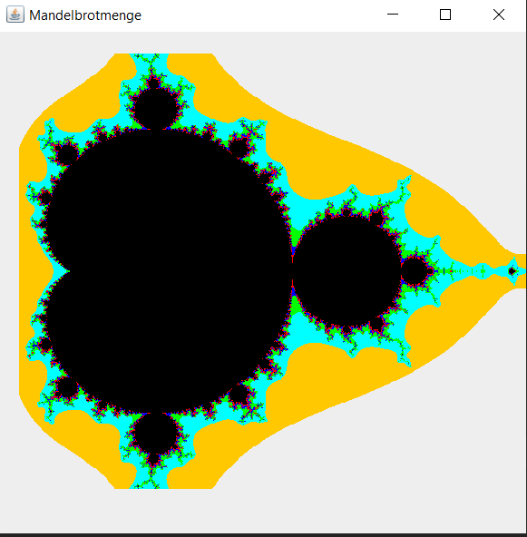

# MandelbrotSet
Old and not well documented code about drawing the mandelbrotset in Java with Swing.
I would not recommend doing graphics today in Swing, as JavaFX provides much more functions and looks better.

